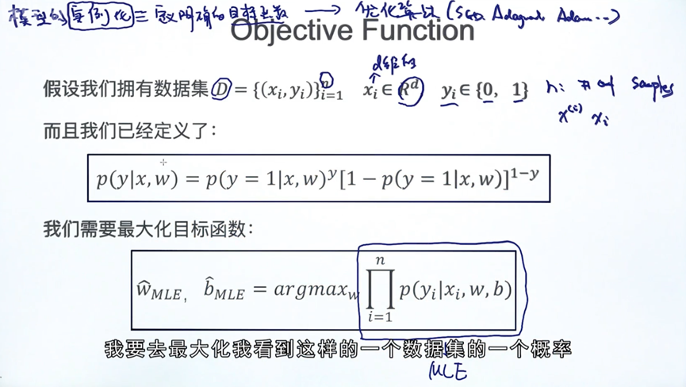

## Welcome to RogerJTX's Notes

You can use the [editor on GitHub](https://github.com/RogerJTX/word2vector/edit/gh-pages/index.md) to maintain and preview the content for your website in Markdown files.

### Main Notes Websites

Main Notes Website  
[https://rogerjtx.github.io/](https://rogerjtx.github.io/)

Word2Vector [ELMo, Bert, ALBert]    
[https://rogerjtx.github.io/word2Vector.io/](https://rogerjtx.github.io/Word2Vector.io/) 

Topbase Knowledge Graph Paper Reproduction And Technical Documentation  
url:

Automatic Code Generation  
url:

Comelot Table Image Recognition   
url:

Aminer Expert Know Graph  
url:

Patent Systemt Keyword Extractor    
url:

Image Style Feature Fusion  
url:

Medical Image Recognition [COVID-19]    
url:

### Word To Vector Part

# Programming Notes Start

----------------------------------------------

# Study Graph

# 逻辑回归 Logistic Function

监督学习：分为  回归问题（返回一个值）和分类问题（返回一个分类）
无监督学习：聚类

           

逻辑函数+线性回归

看决策边界是不是线性的

# 梯度下降 Gradient Descent

步长要合理

预测值和真实值会不断接近

下面是b的求导：

# 随机梯度下降法

mini-batch

